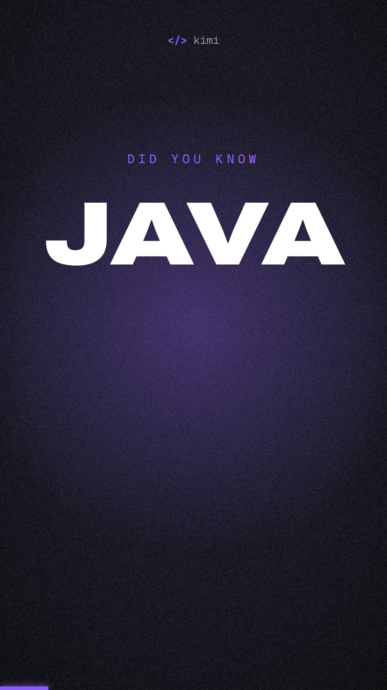

# Kimi Voiceover Video

**A Kimi Code CLI skill that turns a voice recording into a fully edited, animated Short.**

Drop in a voice note. Kimi transcribes it word by word, designs a shot list, builds every scene as
kinetic typography and motion graphics timed to your words, adds synthesized sound design and a
music bed that ducks under your voice, and renders a 1080×1920 Short.



No subscription editor, no uploads: transcription, rendering and audio all run on your machine.

---

## Install

Inside **Kimi Code CLI**:

```
/plugins install https://github.com/Dancan254/kimi-voiceover-video
```

Then start a fresh session.

On first use the skill will check your system dependencies, ask a few brand questions (handle,
colours, fonts, output folder), and download the browsers and fonts it needs. No manual setup steps.

### Requirements

The skill checks these on first run and tells you exactly what is missing:

- Python 3.10+
- Node.js 18+
- FFmpeg
- `faster-whisper` and `numpy`

If you prefer to install them yourself first:

```bash
pip install faster-whisper numpy
# macOS: brew install ffmpeg node
# Ubuntu/Debian: sudo apt install ffmpeg nodejs npm
```

---

## Use it

> make a video out of ~/Downloads/voice-note.m4a

Kimi will estimate the transcription time, show you the shot list for approval, and hand you the
finished file with any image credits.

Want to be on camera? Film yourself saying the script in one take and pass the video:

> make a video out of ~/Movies/take-1.mp4 with my face on the first and last line

Your opening line and sign-off stay on camera; everything between is animated over the same take.

Useful follow-ups:

> use my music track ~/Music/bed.mp3  
> render a landscape version  
> make the intro punchier

---

## What you get

- **Word-level captions** with a highlight box on the current word
- **A new shot every 1–4 seconds**, cut on the word, not the sentence
- **Kinetic typography**: slams, highlight boxes, strike-throughs, counters
- **Scene blocks**: terminals, stamps, VHS/CRT era looks, diagrams, charts, photo tape-ins, logo walls
- **Camera moves**: whips, punch-in zooms, micro-shake on hits
- **Sound design**: hits, whooshes, typing, ticks, risers, dings, errors, stamps
- **Music bed** that ducks under the voice and drops before the final line
- **Film finish**: grain, vignette, loudness normalised to −14 LUFS
- **QA gates**: Kimi reviews a contact sheet before the full render and checks the encoded file

---

## Make it yours

On first run Kimi asks for your handle, colours, fonts and output folder, then writes the brand file
for you. Every question has a default, so "just use the defaults" is a valid answer.

To set the brand yourself instead:

```bash
python3 skills/kimi-voiceover-video/scripts/init_brand.py --handle @yourhandle --preset kimi-violet
```

Presets: `kimi-violet`, `midnight-pink`, `carbon-cyan`, `ink-amber`, `violet-signal`. Pass custom
`--accent` and `--bg` hex values to roll your own. The brand is written to
`~/.config/kimi-voiceover-video/brand.json`.

---

## Good to know

- **Kimi cannot hear the result.** Loudness is measured, taste is not — listen before you post.
- **Render time.** Roughly 3 minutes of frame rendering for a 108-second Short on 10 CPU workers, plus
  transcription at 2–3x realtime.
- **File size.** Film grain resists compression; the encoder caps bitrate so a 108-second vertical
  lands around 110 MB.

## Contributing

Issues and pull requests are welcome — see [CONTRIBUTING.md](CONTRIBUTING.md). Working on the repo
with an AI agent? Point it at [AGENTS.md](AGENTS.md).

## Licence

MIT for this repository. Downloaded tools, fonts, and assets keep their own licences — see
[THIRD_PARTY.md](THIRD_PARTY.md).
